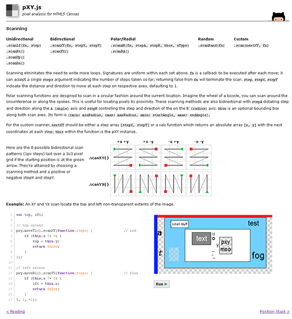

pXY.js
------
pixel analysis for HTML5 Canvas _(MIT Licensed)_

---
### Intro

This lib provides a pleasant interface for analyzing `<canvas>` pixels in an effort to speed up implementation, readability and debugging of custom analysis algorithms such as document feature extraction, OCR segmentation, etc.

---
### Tute/Docs: http://o-0.me/pXY/

